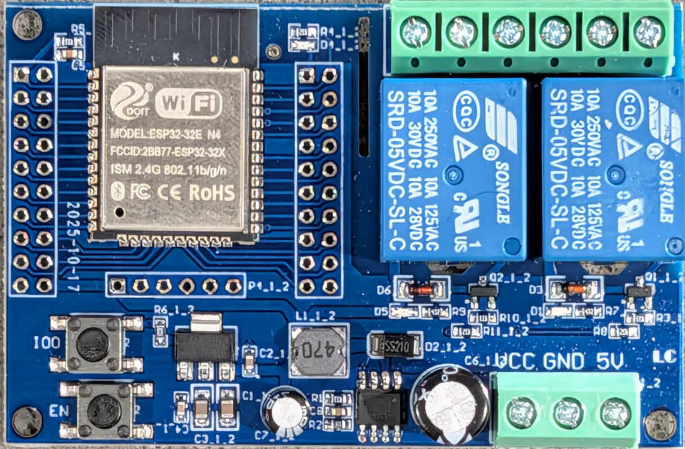
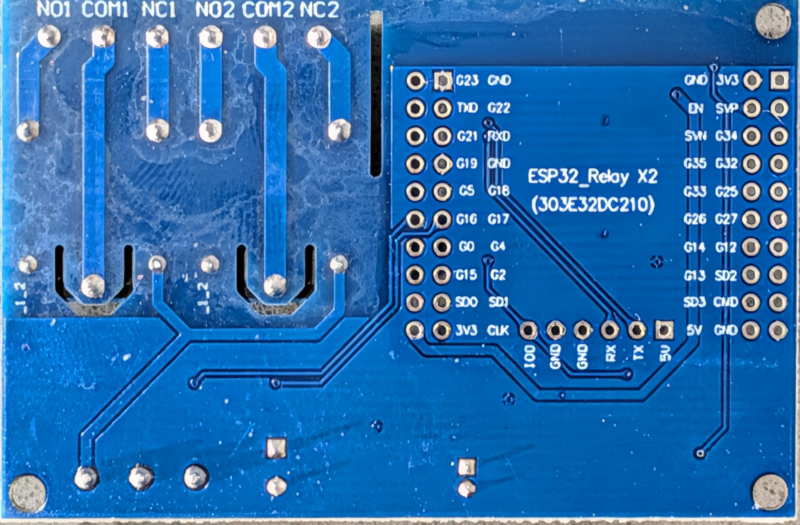

# ESP32 Relay X2

Source: https://www.aliexpress.com/item/1005011803803980.html




A cheap ESP32-WROOM based dual-relay board, DC 5-60V, 2 channels. Common "China ESP32 dual
relay" clone - this design shows up under several near-identical listings and manufacturers,
so pinouts vary between sellers. **Confirm pins against your own board before flashing** if
you sourced it from a different listing than the one above.

## Confirmed pinout

| Function        | GPIO   | Notes                                                    |
|------------------|--------|-----------------------------------------------------------|
| Relay 1          | GPIO16 | Confirmed via multimeter continuity testing                |
| Relay 2          | GPIO17 | Confirmed via multimeter continuity testing                |
| Onboard LED      | GPIO23 | Matches [ESPHome Devices community entry](https://devices.esphome.io/devices/esp32-relay-x2/) |
| Onboard button   | GPIO0  | Also the BOOT/flashing-mode strapping pin - only read as an input after boot completes |

Note: this board's own vendor listing/example firmware claims GPIO26/GPIO27 for the relays.
That turned out to be wrong for this specific board - the ESPHome Devices entry's pinout
(GPIO16/17/23/0) is the one that matches after physical verification. If you've got a board
from a different seller, don't assume either source is correct without checking yourself.

## What this YAML gives you

- **Both relays** exposed as switches in Home Assistant, with:
  - Configurable boot/restore behavior (always on, always off, restore last state, etc.)
  - Optional **inching/momentary mode** per relay - the relay auto-returns to its resting
    state after a configurable delay, instead of behaving as a plain toggle. Useful for
    things like garage door controllers, where a relay just needs to simulate a brief
    button press rather than staying switched.
  - Direction-aware inching via a separate "inverted" flag, for relays that are normally
    powered on and need a momentary *interruption* rather than a momentary *pulse*.
- **Onboard button (GPIO0)** wired up for physical control without touching Home Assistant:
  - Short press → toggle Relay 1
  - Long press (held ≥1s) → toggle Relay 2
- **Onboard LED (GPIO23)** as a status indicator - off when everything's healthy, blinking
  if there's a WiFi/API problem.
- **Diagnostics**: uptime, WiFi signal (dB and %), IP/SSID/MAC, last-restart timestamp,
  connectivity status.
- **Web server** on port 80 for local access without Home Assistant.
- **Bluetooth proxy + BLE tracker**, only scanning while Home Assistant's API is actually
  connected (saves CPU/power when nothing's listening).
- **Improv over BLE** for provisioning WiFi credentials without a serial cable.
- Sensible defaults for logging, mDNS, SNTP time sync, and safe mode/factory reset/restart
  buttons in Home Assistant.

## Not yet configured

- **API encryption** - the native API connection to Home Assistant is currently unencrypted.
  Add an `encryption: key: !secret api_encryption_key` block under `api:` if you want this
  locked down.
- **Physical relay wiring** - if you're driving anything inductive (a motor, solenoid, pump),
  make sure it has its own flyback diode/snubber; the relay contacts and the ESP32 don't like
  switching inductive loads unprotected. Most garage door openers just want a dry momentary
  contact closure across their own button terminals, which this board handles fine as-is.

## Using this as a package

Rather than copying the whole file per device, reference it as an ESPHome `packages:` base
and just override the substitutions you need per physical device:

```yaml
packages:
  base: github://freman/esphome/esp32/esp32_relay_x2/esp32_relay_x2.yaml@main

substitutions:
  name: "garage-door"
  friendly_name: "Garage Door"
  room: "Garage"
  relay1_inching_enabled: "true"   # momentary pulse to simulate a button press
```

See the top of the YAML file for the full list of available substitutions (relay restore
modes, inching duration/direction, WiFi fast-connect, timezone, log level, etc.) - they're
all commented inline.